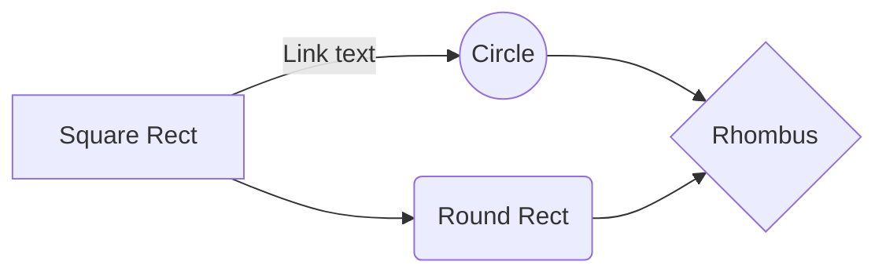
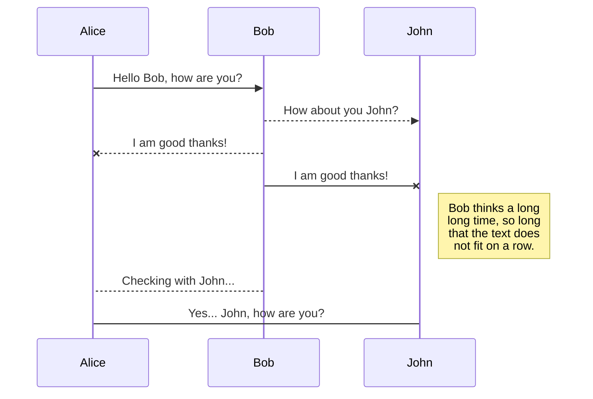
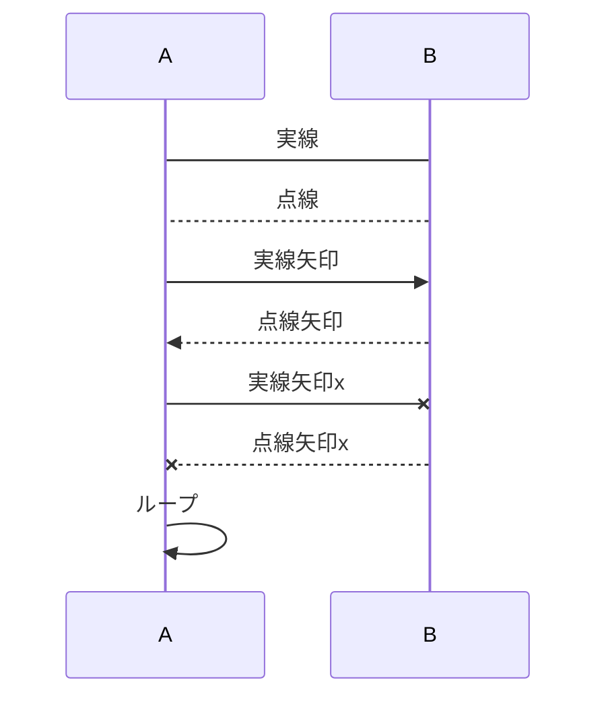
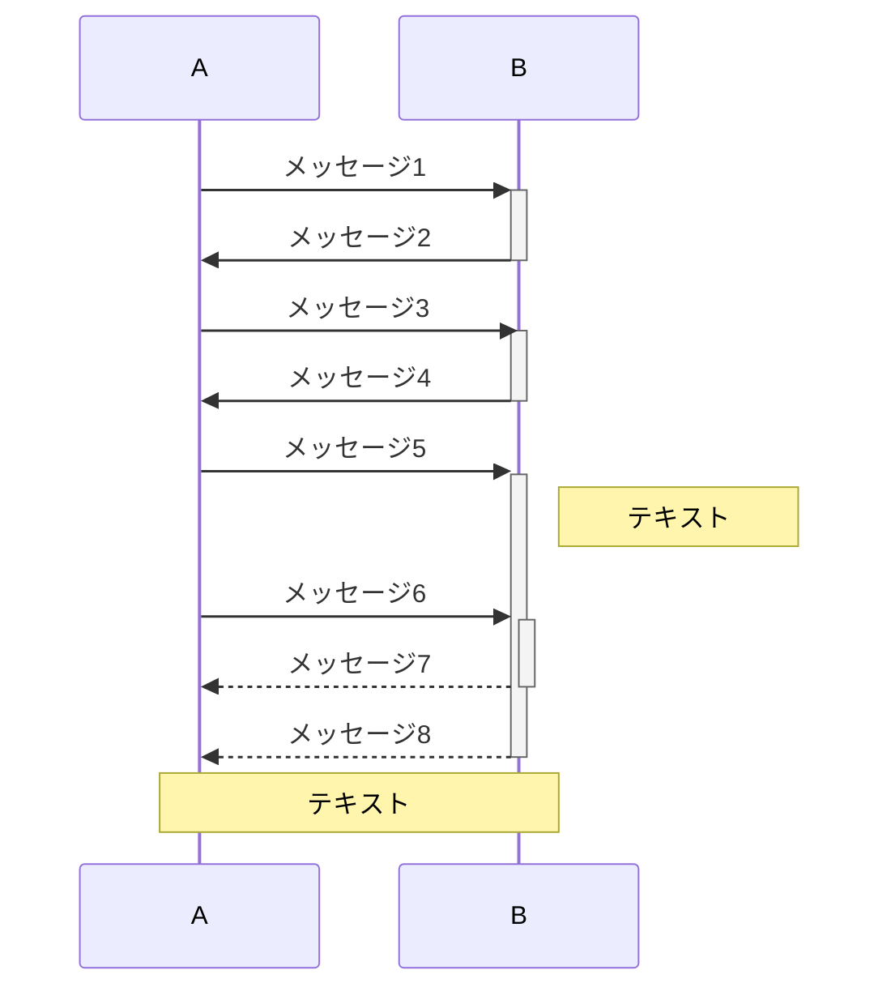
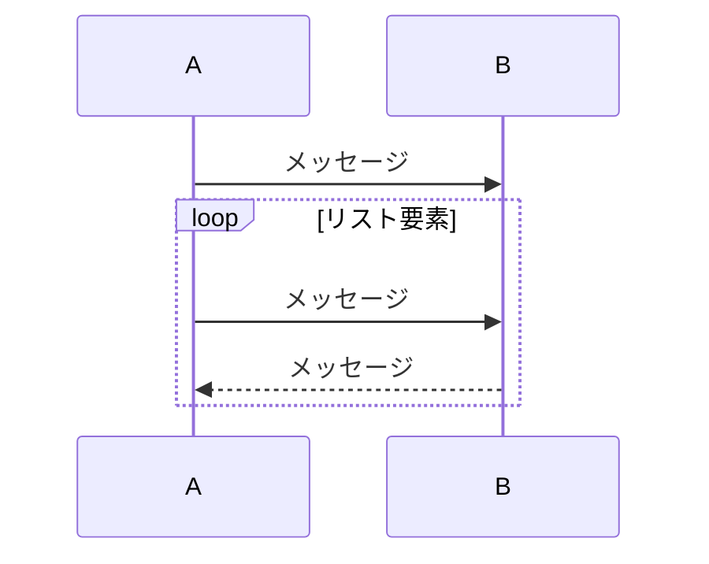
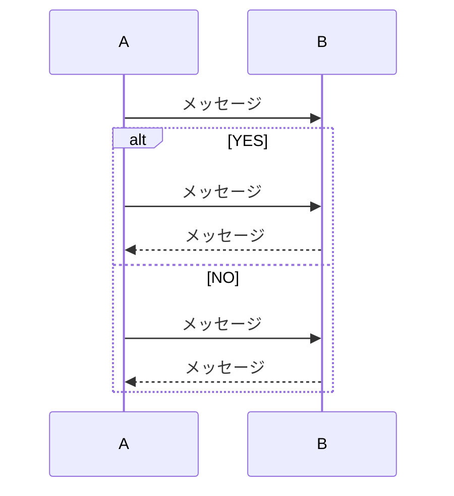
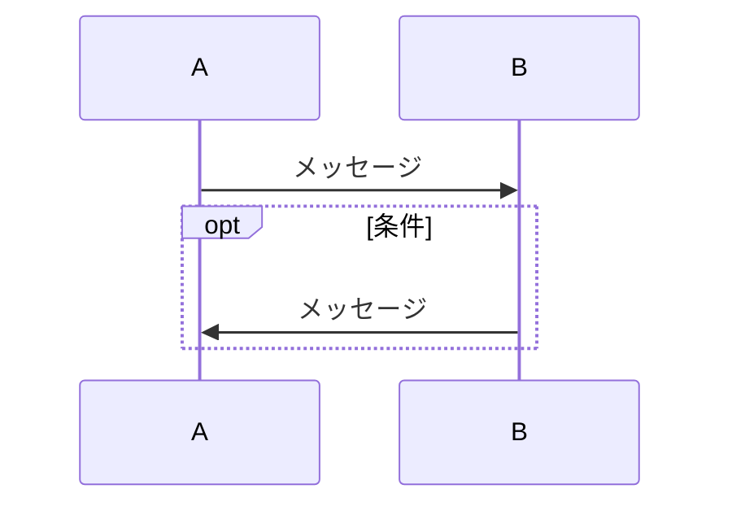
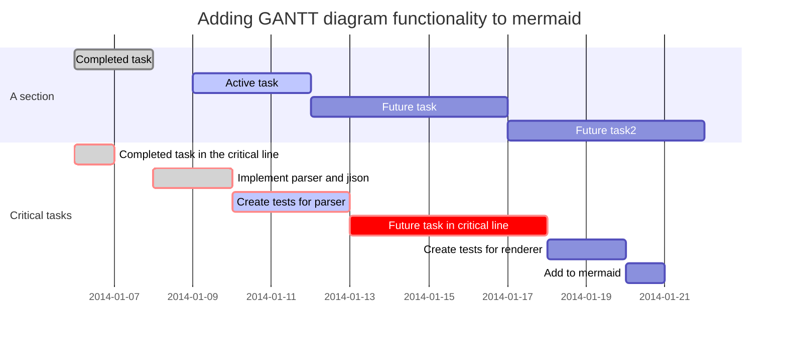
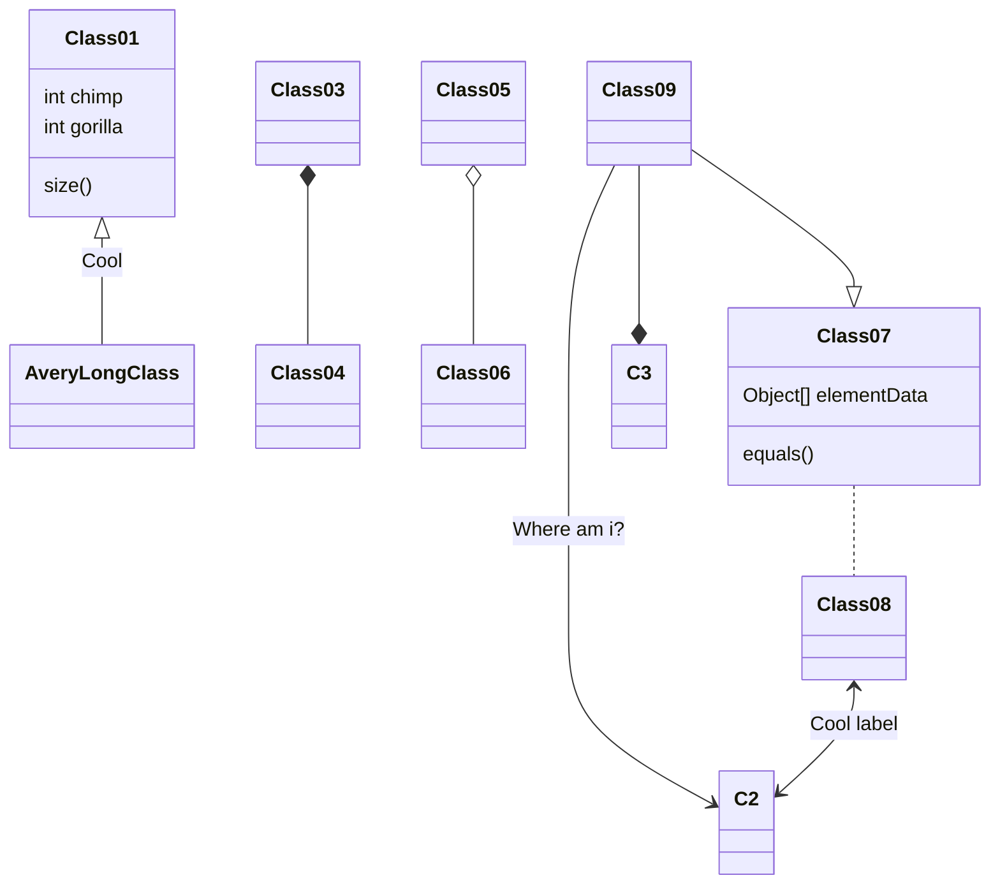

# Markdownでmermaid

Markdown Preview Enhancedが[mermaid](https://mermaidjs.github.io/)を利用したダイアグラムに対応しているようなので試してみた。

# 1. フローチャート（graph）

# 2. シーケンス図（sequenceDiagram）

## おためし

- 線種

- 実行区間とノート

- 繰り返し（loop）

- 条件分岐（alt）

- 条件（opt）

# 3. ガントチャート（gantt）

# 4. クラス図（classDiagram）（MPE未対応？）

# 5. Gitグラフ（gitGraph）（MPE未対応？）

