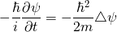

# Markdownで数式あれこれ

- VSCode(Markdown)で数式を書きたい.
- GitHubプレビューでも表示したい.
- PDFファイルにしたい.

ので、いくつか試してみた.

# 1. Markdown+Math (拡張機能)を使ってみる

オイラーの等式 $e^{i\pi}=-1$ はふつくしい.

オイラーの公式

$$e^{i\theta} = cos\theta + isin\theta$$

$$
\begin{pmatrix}y_1 \\ y_2\end{pmatrix} = 
\begin{pmatrix} a && b \\ c && d \end{pmatrix}
\cdot
\begin{pmatrix} x_1 \\ x_2 \end{pmatrix}
$$

ここで、
$\bold{X} = \begin{pmatrix}x_1 \\ x_2\end{pmatrix}$, $\bold{Y} = \begin{pmatrix}y_1 \\ y_2\end{pmatrix}$, $\bold{A}=\begin{pmatrix}a && b \\ c && d\end{pmatrix}$ とすると、

$$\bold{Y} = \bold{A} \cdot \bold{X}$$

となる。

## おためし結果

- Markdownで数式をかけるのが良い
- GitHubで数式レンダリングされない
- MarkdownPDF(拡張機能)で数式はレンダリングされない

# 2. 数式を画像ファイルとして挿入する

数式画像サービスを利用して画像ファイルを作成し、Markdownに挿入する.

数式画像サービス
- [TeXclip](https://texclip.marutank.net/)
- [数式画像作成ツール（物理のかぎしっぽ）](http://hooktail.maxwell.jp/cgi-bin/mathimg.cgi)

シュレディンガー方程式

## おためし結果

- GitHub, MarkdownPDFに対応している
- mdファイルだけでなく、画像ファイルも管理する必要がある（お手軽管理のため、1ファイルになっていてほしい）
- LaTeXコードが残らないので、修正がメンドクサイ（コメントとして別途残す必要がある）

# 3. imageソースに数式画像へのURLリンクを指定する

CODECOGSで数式画像へのURLリンクを生成し、imgソースに生成したURLリンクを指定する.

- [Online LaTeX Equation Editor (CODECOGS)](https://www.codecogs.com/latex/eqneditor.php)

1. CODECOGSでLaTeX数式を入力する
1. サイト下部で`HTML`を指定し、imgタグを生成する
1. コピペ

シュレディンガー方程式

## おためし結果

- GitHub, MarkdownPDFに対応している
- 生成したHTMLにLaTeXコードが残っているので、後日修正が可能
- LaTeXを覚えていなくても、サイトのサポートによりある程度かける
- オフライン環境では利用できない

# リンク

- [LaTeXコマンド集](http://www.latex-cmd.com/)