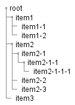

# PlantUML

- [シーケンス図](シーケンス図.md)
- [ユースケース図](ユースケース図.md)
- [クラス図](クラス図.md)（[オブジェクト図](オブジェクト図.md)）
- [アクティビティ図](アクティビティ図.md)
- コンポーネント図
- [状態遷移図（ステートチャート）](ステートチャート.md)
- 配置図
- タイミング図

UML以外にも、ワイヤーフレームやガントチャートとかも書くことができるらしい。

# ダイアグラム共通

- `@startuml`で始まり、`@enduml`で閉じる
- ファイル拡張子は、`.pu`や`.plantuml`など
- `'`（シングルクォーテーション）で１行コメント
- `/'  '/`で複数行コメント
- `title タイトル`
- `caption 見出し`

# Salt

- GUI設計を助けるPlantUMLのサブプロジェクト
- 基本的なヴィジェットがPlantUMLでかける
- `salt{}`又は`@startsalt`～`@endsalt`
- たぶんこれを用いてUI設計を行うことはないと思うが、木構造ヴィジェットは簡単に書けるので、用途はありそうなカンジ

## 木構造ヴィジェット


```
@startuml treewidget
salt
{
{T
+ root
++ item1
+++ item1-1
+++ item1-2
++ item2
+++ item2-1
++++ item2-1-1
+++++ item2-1-1-1
+++ item2-2
+++ item2-3
++ item3
}
}
@endsalt
```

- `{T`で開始して、`}`で閉じる
- 階層は`+`を使用する


# リンク

- [公式ページ](http://plantuml.com/)
- [オンラインジェネレータ](http://www.plantuml.com/plantuml/uml/SyfFKj2rKt3CoKnELR1Io4ZDoSa70000)
- 日本語リファレンス（PDF）
    - [ここ](http://plantuml.com/download)からダウンロード
- [PlantUMLの使い方 - プログラマー雑記帳](http://yohshiy.blog.fc2.com/blog-entry-152.html)

