# PlantUMLサンプル集（アクティビティ図）

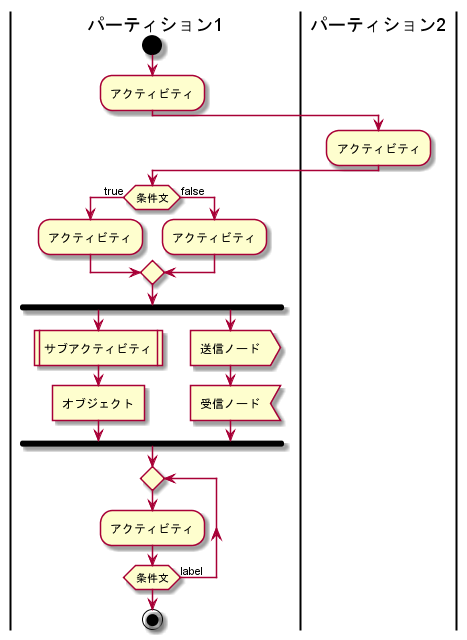
```
@startuml uml_activity

|パーティション1|
start
:アクティビティ;

|パーティション2|
:アクティビティ;

|パーティション1|
if (条件文) then (true)
    :アクティビティ;
else (false)
    :アクティビティ;
endif

fork
:サブアクティビティ|
:オブジェクト]
fork again
:送信ノード>
:受信ノード<
end fork

repeat
:アクティビティ;
repeat while (条件文) is (label)

stop
@enduml
```

# シンプル例

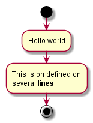
```
@startuml act.1_example1
start 
:Hello world; 
:This is on defined on 
several **lines**; 
stop 
@enduml
```

- `:アクティビティ;`でアクティビティを定義
- `start`で開始ノード
- `stop`で終了ノード

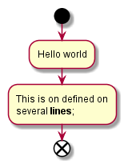
```
@startuml act.1_example2
start 
:Hello world; 
:This is on defined on 
several **lines**; 
end 
@enduml
```

- `end`でフロー終了


# 条件分岐

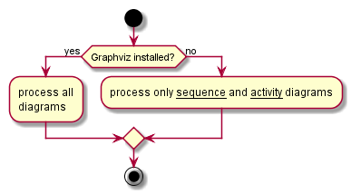
```
@startuml act.2_if1
start
if (Graphviz installed?) then (yes) 
:process all\ndiagrams; 
else (no) 
:process only __sequence__ and __activity__ diagrams; 
endif
stop
@enduml
```

- `if`～`then`～`else`～`endif`で条件分岐
- 構文
    ```
    if (条件文) then (ラベル)
        xxx
    else (ラベル)
        xxx
    endif
    ```

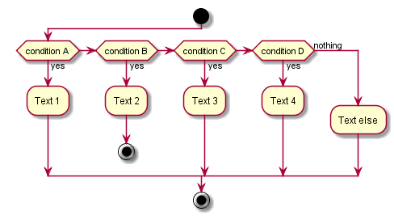
```
@startuml act.2_if2
start 
if (condition A) then (yes) 
:Text 1; 
elseif (condition B) then (yes) 
:Text 2; 
stop 
elseif (condition C) then (yes) 
:Text 3; 
elseif (condition D) then (yes) 
:Text 4;
else (nothing) 
:Text else; 
endif 
stop 
@enduml
```

- `elseif`で、複数の条件分岐を定義
- 構文
    ```
    if (条件文) then (ラベル)
        xxx
    elseif (条件文) then (ラベル)
        xxx
    elseif (条件文) then (ラベル)
        xxx
    elseif (条件文) then (ラベル)
        xxx
    else (ラベル)
        xxx
    endif
    ```


# 繰り返し

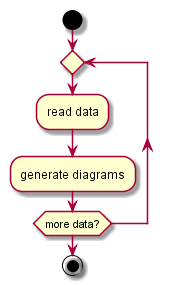
```
@startuml act.3_repeat
start
repeat 
:read data; 
:generate diagrams; 
repeat while (more data?)
stop
@enduml
```

- `repeat`～`repeat while`で後判定の繰り返し
- 構文
    ```
    repeat
        xxx
    repeat while (条件文) is (ラベル)
    ```

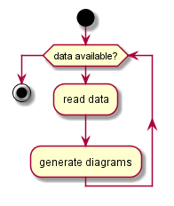
```
@startuml act.3_while
start
while (data available?)
:read data; 
:generate diagrams; 
endwhile
stop
@enduml
```

- `while`～`endwhile`で前判定の繰り返し
- 構文
    ```
    while (条件文)
        xxx
    endwhile
    ```

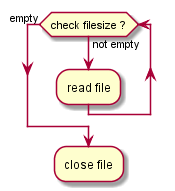
```
@startuml act.3_while2
while (check filesize ?) is (not empty) 
:read file; 
endwhile (empty) 
:close file; 
@enduml
```

- `is`キーワードでラベルを付与することができる（`repeat`も同様）
- 構文
    ```
    while (条件文) is (ラベル)
        xxx
    endwhile (ラベル)

    repeat
        xxx
    repeat while (条件文) is (ラベル)
    ```


# フォークノード・ジョインノード

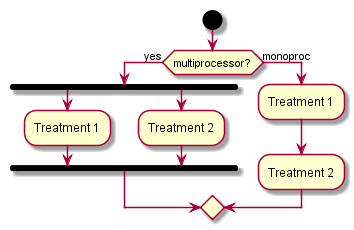
```
@startuml act.4_fork
start
if (multiprocessor?) then (yes) 
fork 
:Treatment 1; 
fork again 
:Treatment 2; 
end fork 
else (monoproc) 
:Treatment 1; 
:Treatment 2; 
endif
@enduml
```

- `fork`, `fork again`で並列処理（フォークノード）
- `end fork`で閉じる（ジョインノード）
- 構文
    ```
    fork
        :foo1;
    fork again
        :foo2;
    fork again
        :foo3;
    end fork
    ```


# 注釈

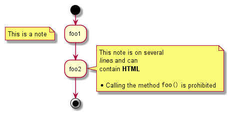
```
@startuml act.5_note
start 
:foo1; 
floating note left: This is a note
:foo2;
note right 
This note is on several 
//lines// and can 
contain <b>HTML</b> 
==== 
* Calling the method ""foo()"" is prohibited 
end note 
stop
@enduml
```


# 色指定

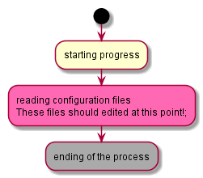
```
@startuml act.6_color
start 
:starting progress; 
#HotPink:reading configuration files 
These files should edited at this point!; 
#AAAAAA:ending of the process;
@enduml
```


# 矢印

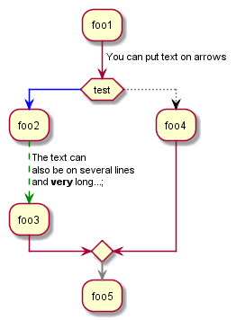
```
@startuml act.7_arrow
:foo1; 
-> You can put text on arrows; 
if (test) then 
-[#blue]-> 
:foo2; 
-[#green,dashed]-> The text can 
also be on several lines 
and **very** long...; 
:foo3; 
else 
-[#black,dotted]-> 
:foo4; 
endif 
-[#gray,bold]-> 
:foo5; 
@enduml
```


# グループ化

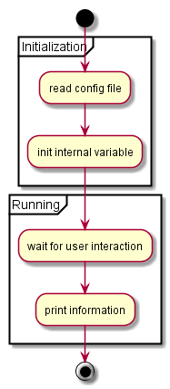
```
@startuml act.8_grouping
start 
partition Initialization { 
:read config file;
:init internal variable; 
} 
partition Running { 
:wait for user interaction; 
:print information; 
}
stop 
@enduml
```

- `partition グループ名 {}`でグループ化


# レーン

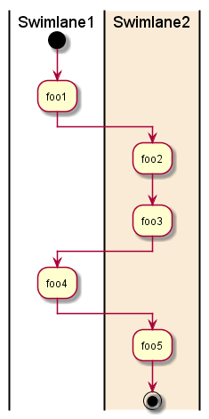
```
@startuml act.9_lane
|Swimlane1| 
start 
:foo1; 
|#AntiqueWhite|Swimlane2| 
:foo2; 
:foo3; 
|Swimlane1| 
:foo4; 
|Swimlane2| 
:foo5; 
stop 
@enduml
```

- `|xxx|`で、レーン（パーティション）


# SDL図

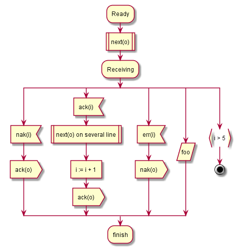
```
@startuml act.10
:Ready; 
:next(o)| 
:Receiving; 
split 
:nak(i)< 
:ack(o)> 
split again 
:ack(i)< 
:next(o) on several line| 
:i := i + 1] 
:ack(o)> 
split again 
:err(i)< 
:nak(o)> 
split again 
:foo/ 
split again 
:i > 5} 
stop 
end split 
:finish; 
@enduml
```

- 通常の`:xxx;`の終端記号`;`を変更することにより、ノードの図形を変更することができる

|記号|説明|
|:-:|---|
|`:foo;`|アクティビティノード（角が丸い四角）|
|`:foo|`|サブアクティビティノード（両端が二重線）|
|`:foo]`|オブジェクトノード（四角）|
|`:foo>`|メッセージ送信ノード（右側に凸の五角形）|
|`:foo<`|メッセージ受信ノード（左側に凹の五角形）|


# 複雑な例

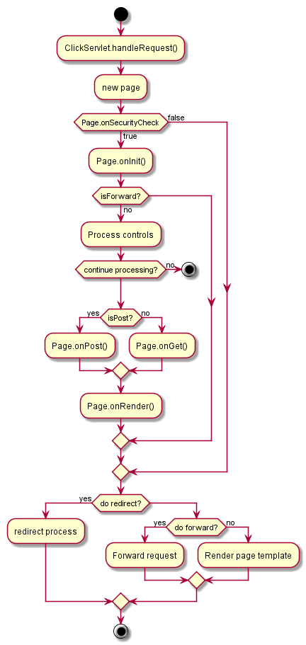
```
@startuml act.11_example
start 
:ClickServlet.handleRequest(); 
:new page; 

if (Page.onSecurityCheck) then (true) 
:Page.onInit(); 
if (isForward?) then (no) 
:Process controls; 
if (continue processing?) then (no) 
stop 
endif

if (isPost?) then (yes) 
:Page.onPost(); 
else (no) 
:Page.onGet(); 
endif 
:Page.onRender(); 
endif 
else (false) 
endif

if (do redirect?) then (yes) 
:redirect process; 
else 
if (do forward?) then (yes) 
:Forward request; 
else (no) 
:Render page template; 
endif 
endif
stop
@enduml
```
