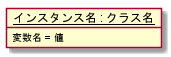
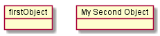
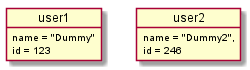

# PlantUMLサンプル集（オブジェクト図）



```
@startuml uml_object
object "__インスタンス名 : クラス名__" as foo {
    変数名 = 値
}
@enduml
```

# オブジェクトの定義


```
@startuml object.1_basic
object firstObject 
object "My Second Object" as o2 
@enduml
```

- `object`キーワードで、オブジェクトを定義
- 基本的にクラス図と同様の記法でOK


# フィールドの定義


```
@startuml object.2_field
object user1
user1 : name = "Dummy" 
user1 : id = 123

object user2 {
    name = "Dummy2",
    id = 246
}
@enduml
```

- `:`の後にフィールド定義を記述する
- `{}`で括っても良い
