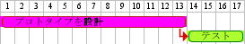

# PlantUMLサンプル集（ガントチャート）

# タスク定義


```
@startgantt gantt.1_simple
[設計] lasts 15 days
[テスト] lasts 10 days
@endgantt
```


# 依存関係


```
@startgantt gantt.2_consecutivetask1
[設計] lasts 15 days
[テスト] lasts 10 days
[テスト] starts at [設計]'s end
@endgantt
```


```
@startgantt gantt.2_consecutivetask2
[設計] lasts 14 days
then [テスト] lasts 4 days
then [デプロイ] lasts 6 days
@endgantt
```


```
@startgantt gantt.2_consecutivetask3
[設計] lasts 14 days
[ビルド] lasts 4 days
[テスト準備] lasts 6 days
[設計] -> [ビルド]
[設計] -> [テスト準備]
@endgantt
```


# エイリアス


```
@startgantt gantt.3_alias
[プロトタイプを設計] as [設計] lasts 15 days
[プロトタイプをテスト] as [テスト] lasts 10 days
[テスト] starts at [設計]'s end
@endgantt
```


# 色指定


```
@startgantt gantt.4_color
[プロトタイプを設計] lasts 13 days
[テスト] lasts 4 days
[テスト] starts at [プロトタイプを設計]'s end
[プロトタイプを設計] is colored in Fuchsia/FireBrick 
[テスト] is colored in GreenYellow/Green 
@endgantt
```


# マイルストーン


```
@startgantt gantt.5_milestone
[プロトタイプをテスト] lasts 10 days
[プロトタイプが完成] happens at [プロトタイプをテスト]'s end
[製造ラインの準備] lasts 12 days
[製造ラインの準備] starts at [プロトタイプをテスト]'s end
@endgantt
```


# 日付


```
@startgantt gantt.6_date
Project starts the 20th of september 2017
[プロトタイプを設計] as [タスク1] lasts 13 days
[タスク1] is colored in Lavender/LightBlue
@endgantt
```


# 休日


```
@startgantt gantt.7_holiday
project starts the 2018/04/09
saturday are closed
sunday are closed
2018/05/01 is closed
2018/04/17 to 2018/04/19 is closed
[設計] lasts 14 days
[テスト] lasts 4 days
[テスト] starts at [設計]'s end
[設計] is colored in Fuchsia/FireBrick 
[テスト] is colored in GreenYellow/Green 
@endgantt
```


# セパレーター


```
@startgantt gantt.8_separator
[Task1] lasts 10 days
then [Task2] lasts 4 days
-- Phase Two --
then [Task3] lasts 5 days
then [Task4] lasts 6 days
@endgantt
```


# 複雑な例


```
@startgantt gantt.9_complicated
[プロトタイプを設計] lasts 13 days and is colored in Lavender/LightBlue
[プロトタイプをテスト] lasts 9 days and is colored in Coral/Green and starts 3 days after [プロトタイプを設計]'s end
[テストを実装] lasts 5 days and ends at [プロトタイプを設計]'s end
[テストプログラマの雇用] lasts 6 days and ends at [テストを実装]'s start
[テストの実施] is colored in Coral/Green
[テストの実施] starts 1 day before [プロトタイプをテスト]'s start and ends at [プロトタイプをテスト]'s end
@endgantt
```