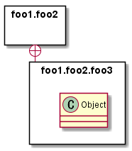
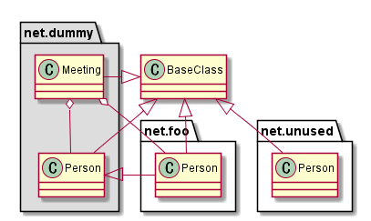
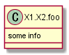
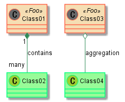

# PlantUMLサンプル集（クラス図）

# クラス関係

### 関連 (`Class01 - Class02`)


### 集約 (`Class01 o- Class02`)


### コンポジション (`Class01 *- Class02`)


### 依存 (`Class01 <. Class02`)


### 汎化 (`Class01 <|- Class02`)


### 実現 (`Class01 <|. Class02`)


### まとめ


```
@startuml class.1_relation1
Class01 <|-- Class02 
Class03 *-- Class04 
Class05 o-- Class06 
Class07 .. Class08 
Class09 -- Class10
@enduml
```


```
@startuml class.1_relation2
Class11 <|.. Class12 
Class13 --> Class14 
Class15 ..> Class16 
Class17 ..|> Class18 
Class19 <--* Class20
@enduml
```


```
@startuml class.1_relation3
Class21 #-- Class22 
Class23 x-- Class24 
Class25 }-- Class26 
Class27 +-- Class28 
Class29 ^-- Class30 
@enduml
```


# 関係ラベル／多重度


```
@startuml class.2_label1
Class01 "1" *-- "many" Class02 : contains
Class03 o-- Class04 : aggregation
Class05 --> "1" Class06
@enduml
```

- シーケンス図等と同様、`:`の後ろが関係ラベルとなる
- `""`で、多重度となる


```
@startuml class.2_label2
class Car
Driver - Car : drives > 
Car *- Wheel : have 4 > 
Car -- Person : < owns
@enduml
```

- 関係ラベルに`>`又は`<`で、矢印を追加


# メンバー定義


```
@startuml class.3_member1
Object <|-- ArrayList
Object : equals() 
ArrayList : Object[] elementData 
ArrayList : size()
@enduml
```

- クラス名の後の`:`に続けて、メソッド、フィールドを定義できる
- メソッドとフィールドの区別は`()`の有無で判定される


```
@startuml class.3_member2
class Dummy { 
    String data 
    void methods() 
}
class Flight { 
    flightNumber : Integer 
    departureTime : Date 
} 
@enduml
```

- `{}`で、フィールド、メソッドをくくることが可能


```
@startuml class.3_member3
class Dummy {
    {field} A field (despite parentheses) 
    {method} Some method 
}
@enduml
```

- フィールドやメソッドは、`{field}`や`{method}`で指定することも可能


# 可視性


```
@startuml class.4_accessibility1
class Dummy {
     -field1 
     #field2 
     ~method1() 
     +method2() 
}
@enduml
```

|記号|可視性|
|:-:|---|
|+|public|
|#|protected|
|-|private|
|~|package private (internal)|


```
@startuml class.4_accessibility2
skinparam classAttributeIconSize 0 
class Dummy { 
    -field1 
    #field2 
    ~method1() 
    +method2() 
}
@enduml
```

- `skinparam classAttributeIconSize 0`で、可視性のアイコン表示を無くすことができる


# メンバー修飾


```
@startuml class.4_classmodifier
class Dummy {
     {static} String id 
     {abstract} void methods()
}
@enduml
```

- `{static}`で静的修飾
- `{abstract}`で抽象修飾


# セパレーター


```
@startuml class.6_separator
class Foo1 { 
You can use 
several lines 
..
as you want 
and group 
==
things together.
__
You can have as many groups 
as you want 
--
End of class
}
class User { 
.. Simple Getter ..
+ getName() 
+ getAddress() 
.. Some setter ..
+ setName() 
__ private data __
int age 
-- encrypted --
String password 
}
@enduml
```

|記号|線種|
|:-:|:-:|
|`==`|二重線|
|`__`|太線|
|`--`|細線|
|`..`|破線|


# 注釈とステレオタイプ


```
@startuml class.7_note_stereotype
class Object << general >> 
Object <|--- ArrayList

note top of Object : In java, every class\nextends this one.

note "This is a floating note" as N1 
note "This note is connected\nto several objects." as N2 
Object .. N2 
N2 .. ArrayList

class Foo 
note left: On last defined class
@enduml
```

- クラス名の後に`<< >>`でステレオタイプ
- ノートは、`..`で他のオブジェクトとリンク可能


```
@startuml class.7_linknote
class Dummy 
Dummy --> Foo : A link 
note on link #red: note that is red

Dummy --> Foo2 : Another link
note right on link #blue
this is my note on right link
and in blue
end note
@enduml
```

- リンク定義直後の`note on link`で、リンクに対するノートが可能


# 抽象クラスとインタフェースクラス


```
@startuml class.8_abstract_interface
abstract class AbstractList 
abstract AbstractCollection 
interface List 
interface Collection

List <|-- AbstractList 
Collection <|-- AbstractCollection

Collection <|- List 
AbstractCollection <|- AbstractList 
AbstractList <|-- ArrayList

class ArrayList { 
    Object[] elementData 
    size() 
}
enum TimeUnit { 
    DAYS 
    HOURS 
    MINUTES 
}
annotation SuppressWarnings
@enduml
```

- `abstract Foo`, `abstract class Foo`で抽象クラス
- `interface Foo`でインタフェースクラス
    - `interface class Foo`はダメ
- `enum Foo`で列挙型
- `annotation Foo`というのもある


# ジェネリック


```
@startuml class.9_generic
class Foo<? extends Element> { 
    int size() 
} 
Foo *- Element
@enduml
```

- `<>`でジェネリック


# カスタムアイコン


```
@startuml class.10_customicon
class System << (S,#FF7700) Singleton >> 
class Date << (D,orchid) >> 
@enduml
```

- ステレオタイプに`(S,color)`のように文字と色を指定することで、規定のC,A,I,E以外のアイコンを付与することができる


# パッケージ


```
@startuml class.11_package1
package "Classic Collections" #DDDDDD { 
Object <|-- ArrayList
}
package net.sourceforge.plantuml { 
Object <|-- Demo1
Demo1 *- Demo2
}
@enduml
```


```
@startuml class.11_package2
scale 750 width 
package foo1 <<Node>> { 
class Class1 
}
package foo2 <<Rectangle>> { 
class Class2
}
package foo3 <<Folder>> { 
class Class3 
}
package foo4 <<Frame>> { 
class Class4
}
package foo5 <<Cloud>> { 
class Class5
}
package foo6 <<Database>> { 
class Class6
}
@enduml
```

- `package Foo <<～>>`で、パッケージスタイルを変更できる



```
@startuml class.11_package3
skinparam packageStyle rectangle
package foo1.foo2 {
}
package foo1.foo2.foo3 { 
class Object 
}
foo1.foo2 +-- foo1.foo2.foo3
@enduml
```

- パッケージ間はリンク可能

# 名前空間


```
@startuml class.12_namespace
class BaseClass
namespace net.dummy #DDDDDD { 
.BaseClass <|-- Person 
Meeting o-- Person
.BaseClass <|- Meeting
}
namespace net.foo { 
net.dummy.Person <|- Person 
.BaseClass <|-- Person
net.dummy.Meeting o-- Person
}
BaseClass <|-- net.unused.Person
@enduml
```

- `.`で名前空間の表現が可能
- デフォルト名前空間（無名空間）は、`.`始まり


```
@startuml class.12_namespace2
set namespaceSeparator :: 
class X1::X2::foo { 
some info
}
@enduml
```

- `set namespaceSeparator xxx`で、名前空間の区切り文字を設定できる


```
@startuml class.12_namespace3
set namespaceSeparator none 
class X1.X2.foo { 
some info 
}
@enduml
```

- `set namespaceSeparator none`で、名前空間のパッケージを表示しないようにできる（クラス名が完全修飾名で表示される）


# ロリポップ（`()--`）


```
@startuml class.13_lollipop
class foo 
bar ()- foo 
@enduml
```


# 配置


```
@startuml class.14_location1
Room o- Student 
Room *-- Chair 
@enduml
```


```
@startuml class.14_location2
Student -o Room 
Chair --* Room 
@enduml
```


```
@startuml class.14_location3
foo -left-> dummyLeft 
foo -right-> dummyRight 
foo -up-> dummyUp 
foo -down-> dummyDown 
@enduml
```


# 関連クラス


```
@startuml class.15_relatedclass1
class Student { 
Name
} 
Student "0..*" - "1..*" Course 
(Student, Course) .. Enrollment
class Enrollment { 
drop() 
cancel() 
} 
@enduml
```


```
@startuml class.15_relatedclass2
class Student { 
Name 
} 
Student "0..*" -- "1..*" Course 
(Student, Course) . Enrollment
class Enrollment { 
drop() 
cancel() 
} 
@enduml
```


# スキンパラメータ


```
@startuml class.16_skin1
skinparam class { 
BackgroundColor PaleGreen 
ArrowColor SeaGreen 
BorderColor SpringGreen 
} 
skinparam stereotypeCBackgroundColor YellowGreen
Class01 "1" *-- "many" Class02 : contains
Class03 o-- Class04 : aggregation
@enduml
```


```
@startuml class.16_skin2
skinparam class { 
BackgroundColor PaleGreen 
ArrowColor SeaGreen 
BorderColor SpringGreen 
BackgroundColor<<Foo>> Wheat 
BorderColor<<Foo>> Tomato 
} 
skinparam stereotypeCBackgroundColor YellowGreen 
skinparam stereotypeCBackgroundColor<< Foo >> DimGray
Class01 <<Foo>> 
Class03 <<Foo>> 
Class01 "1" *-- "many" Class02 : contains
Class03 o-- Class04 : aggregation
@enduml
```


```
@startuml class.16_skin3
skinparam backgroundcolor AntiqueWhite/Gold 
skinparam classBackgroundColor Wheat|CornflowerBlue
class Foo #red-green 
note left of Foo #blue\9932CC 
this is my 
note on this class 
end note
package example #GreenYellow/LightGoldenRodYellow { 
class Dummy 
}
@enduml
```

- `/`, `|`, `\`, `-`でグラデーション方向を指定できる


# レイアウト


```
@startuml class.17_layout
class Bar1 
class Bar2 
together { 
class Together1 
class Together2 
class Together3 
} 
Together1 - Together2 
Together2 - Together3 
Together2 -[hidden]--> Bar1 
Bar1 -[hidden]> Bar2
@enduml
```

- `together { }`でクラスをグループ化することで、（ある程度は）整列して配置することができる
