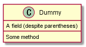

# PlantUMLサンプル集（クラス図）

# クラス関係

### 関連 (`--`)


### 集約 (`o-`)


### コンポジション (`*-`)


### 依存 (`<.`)


### 汎化 (`<|-`)


### 実現 (`<|.`)


### まとめ


```
@startuml class.1_relation1
Class01 <|-- Class02 
Class03 *-- Class04 
Class05 o-- Class06 
Class07 .. Class08 
Class09 -- Class10
@enduml
```


```
@startuml class.1_relation2
Class11 <|.. Class12 
Class13 --> Class14 
Class15 ..> Class16 
Class17 ..|> Class18 
Class19 <--* Class20
@enduml
```


```
@startuml class.1_relation3
Class21 #-- Class22 
Class23 x-- Class24 
Class25 }-- Class26 
Class27 +-- Class28 
Class29 ^-- Class30 
@enduml
```

# 関係ラベル／多重度


```
@startuml class.2_label1
Class01 "1" *-- "many" Class02 : contains
Class03 o-- Class04 : aggregation
Class05 --> "1" Class06
@enduml
```

- シーケンス図等と同様、`:`の後ろが関係ラベルとなる
- `""`で、多重度となる


```
@startuml class.2_label2
class Car
Driver - Car : drives > 
Car *- Wheel : have 4 > 
Car -- Person : < owns
@enduml
```

- 関係ラベルに`>`又は`<`で、矢印を追加

# メンバー定義


```
@startuml class.3_member1
Object <|-- ArrayList
Object : equals() 
ArrayList : Object[] elementData 
ArrayList : size()
@enduml
```

- クラス名の後の`:`に続けて、メソッド、フィールドを定義できる
- メソッドとフィールドは`()`の有無で判定される


```
@startuml class.3_member2
class Dummy { 
    String data 
    void methods() 
}
class Flight { 
    flightNumber : Integer 
    departureTime : Date 
} 
@enduml
```

- `{}`で、フィールド、メソッドをくくることが可能


```
@startuml class.3_member3
class Dummy {
    {field} A field (despite parentheses) 
    {method} Some method 
}
@enduml
```

- `()`の有無ではなく、`{field}`や`{method}`で指定することも可能

# 可視性


```
@startuml class.4_accessibility1
class Dummy {
     -field1 
     #field2 
     ~method1() 
     +method2() 
}
@enduml
```

|記号|可視性|
|:-:|---|
|+|public|
|#|protected|
|-|private|
|~|package private (internal)|


```
@startuml class.4_accessibility2
skinparam classAttributeIconSize 0 
class Dummy { 
    -field1 
    #field2 
    ~method1() 
    +method2() 
}
@enduml
```

- `skinparam classAttributeIconSize 0`で、可視性のアイコン表示を無くすことができる

# メンバー修飾


```
@startuml class.4_classmodifier
class Dummy {
     {static} String id 
     {abstract} void methods()
}
@enduml
```

- `{static}`で静的修飾
- `{abstract}`で抽象修飾

