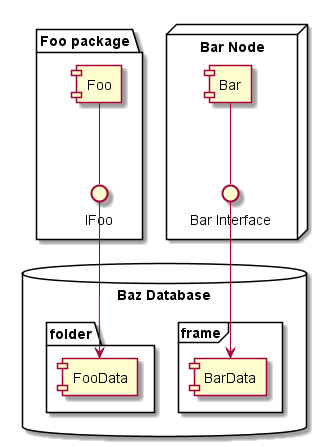
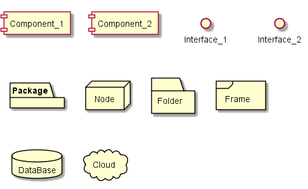

# PlantUMLサンプル集（コンポーネント図）


```
@startuml component_diagram
package "Foo package" {
    component Foo
    interface IFoo
    Foo -- IFoo
}
node "Bar Node" {
    [Bar]
    () "Bar Interface" as IBar
    Bar -- IBar
}
database "Baz Database" {
    folder "folder" {
        [FooData]
    }
    frame "frame" {
        [BarData]
    }
}

IFoo --> FooData
IBar --> BarData
@enduml
```

# 部品


```
@startuml cmp.1_parts
component Component_1
[Component_2]

interface Interface_1
() Interface_2

package Package
node Node
folder Folder
frame Frame
database DataBase
cloud Cloud
@enduml
```

- コンポーネントは、`component`キーワード 又は `[]` で定義する
- インタフェースは、`interface`キーワード 又は `()` で定義する
