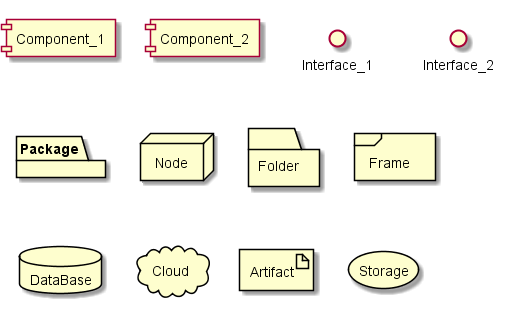
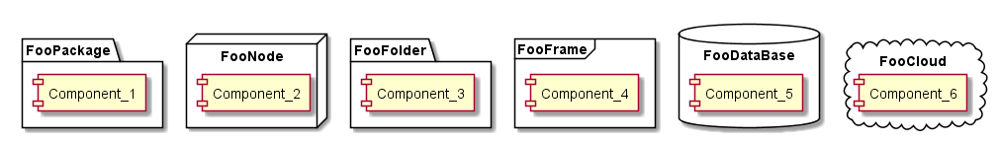
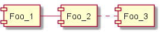
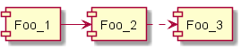
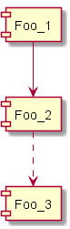
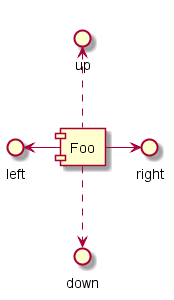

# PlantUMLサンプル集（コンポーネント図）


```
@startuml component_diagram
package "Foo package" {
    component Foo
    interface IFoo
    Foo -- IFoo
}
node "Bar Node" {
    [Bar]
    () "Bar Interface" as IBar
    Bar -- IBar
}
database "Baz Database" {
    folder "folder" {
        [FooData]
    }
    frame "frame" {
        [BarData]
    }
}

IFoo --> FooData
IBar --> BarData
@enduml
```

# 部品

**UML1スタイル**


```
@startuml cmp.1_parts_uml1

component Component_1
[Component_2]

interface Interface_1
() Interface_2

package Package
node Node
folder Folder
frame Frame
database DataBase
cloud Cloud

' リファレンスにはないけど、これらも使える
artifact Artifact
storage Storage
@enduml
```

**UML2スタイル**


```
@startuml cmp.1_parts_uml2
skinparam componentStyle uml2

component Component_1
[Component_2]

interface Interface_1
() Interface_2

package Package
node Node
folder Folder
frame Frame
database DataBase
cloud Cloud

' リファレンスにはないけど、これらも使える
artifact Artifact
storage Storage
@enduml
```

- コンポーネントは、`component`キーワード 又は `[]` で定義する
- インタフェースは、`interface`キーワード 又は `()` で定義する
- `skinparam componentStyle uml2`で、コンポーネントの表記をUML2形式に変更できる

# ノート


```
@startuml cmp.2_note
[Foo]
note right of Foo: "note right of Foo"
note left of Foo: "note left of Foo"
note top of Foo: "note top of Foo"
note bottom of Foo: "note bottom of Foo"

[Bar]
note right of Bar
改行を
含む
ノート
end note

note bottom of Bar {
    角カッコでも
    複数行記載できる
}
@enduml
```

- `note right of`, `note left of`, `note top of`, `note bottom of`でノートを追加できる
- 複数行のノートを記載する場合は、`note xxx of xxxx`～`end note`のブロック内に記載する
    - 角カッコ`{}`でも可

# グルーピング


```
@startuml cmp.3_grouping
package FooPackage {
    [Component_1]
}
node FooNode {
    [Component_2]
}
folder FooFolder {
    [Component_3]
}
frame FooFrame {
    [Component_4]
}
database FooDataBase {
    [Component_5]
}
cloud FooCloud {
    [Component_6]
}
@enduml
```

- 以下のキーワードは、ブロックで入れ子にすることで内部に別パーツを有することができる
    - `package`
    - `node`
    - `folder`
    - `frame`
    - `database`
    - `cloud`

# 関連


```
@startuml cmp.4_arrow_1
[Foo_1]
[Foo_2]
[Foo_3]
Foo_1 - Foo_2
Foo_2 . Foo_3
@enduml
```


```
@startuml cmp.4_arrow_2
[Foo_1]
[Foo_2]
[Foo_3]

Foo_1 -> Foo_2
Foo_2 .> Foo_3
@enduml
```


```
@startuml cmp.4_arrow_3
[Foo_1]
[Foo_2]
[Foo_3]

Foo_1 --> Foo_2
Foo_2 ..> Foo_3
@enduml
```


```
@startuml cmp.4_arrow_4
[Foo]
() right
() left
() up
() down

Foo -right-> right
Foo -left-> left
Foo .up.> up
Foo .down.> down
@enduml

```

- ダッシュ`-`で実線、ピリオド`.`で破線になる
- ダッシュ又はピリオド1つで水平方向に、2つで垂直方向の関連線となる
- `right`, `left`, `up`, `down`キーワードを指定することで、方向を指定することができる
