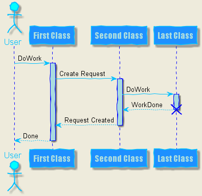

# PlantUMLサンプル集（シーケンス図）

# 基本


```
@startuml seq.1_Basic
Alice -> Bob: Authentication Request 
Bob --> Alice: Authentication Response
Alice -> Bob: Another authentication Request 
Alice <-- Bob: another authentication Response
@enduml
```

- `@startuml`で始まり、`@enduml`で閉じる
- ファイル拡張子は、`.pu`や`.plantuml`など
- `->`で実線矢印、`-->`で点線矢印
- `'`（シングルクォーテーション）で１行コメント
- `/'  '/`で複数行コメント
- 分類子（アクター）を宣言すると、並び順を入れ替えることができる（宣言しない場合は、登場順となる）
- 分類子（アクター）宣言時、`as`でエイリアス


# アクター


```
@startuml seq.2_Actor
actor Foo1
boundary Foo2
control Foo3
entity Foo4
database Foo5
collections Foo6
participant Foo7

Foo1 -> Foo2 : To boundary
Foo1 -> Foo3 : To control
Foo1 -> Foo4 : To entity
Foo1 -> Foo5 : To database
Foo1 -> Foo6 : To collections
Foo1 -> Foo7 : To participant
@enduml
```

|キーワード|意味|
|---|---|
|actor|ユーザー|
|boundary|バウンダリ|
|control|コントロール|
|entity|エンティティ|
|database|データベース|
|collections|コレクション|
|participant|属性なし（default）|

# 矢印形状


```
@startuml seq.3_Arrow
Bob ->x Alice 
Bob -> Alice 
Bob ->> Alice
Bob -\ Alice
Bob \\- Alice 
Bob //-- Alice
Bob ->o Alice 
Bob o\\-- Alice
Bob <-> Alice 
Bob <->o Alice
@enduml
```

# シーケンス番号


```
@startuml seq.4_Numbering
' 連番
autonumber 
Bob -> Alice : Authentication Request 
Bob <- Alice : Authentication Response

' 開始番号指定
autonumber 15 
Bob -> Alice : Another authentication Request 
Bob <- Alice : Another authentication Response

' 開始番号＋増分指定
autonumber 40 10 
Bob -> Alice : Yet another authentication Request
Bob <- Alice : Yet another authentication Response
@enduml
```

- `autonumber`でシーケンス番号を自動付与
- 第1引数で開始番号、第2引数で増分を指定可能

# グループ化


```
@startuml seq.5_Grouping
Alice -> Bob: Authentication Request

alt successful case

Bob -> Alice: Authentication Accepted

else some kind of failure

Bob -> Alice: Authentication Failure 

group My own label 

Alice -> Log : Log attack start 

loop 1000 times 
Alice -> Bob: DNS Attack 
end

Alice -> Log : Log attack end 
end

else Another type of failure
Bob -> Alice: Please repeat

end 

@enduml
```

以下のキーワードでグループ化（`end`で閉じる）
- alt/else（分岐）
- opt（条件）
- loop（反福）
- par/else（並列）
- break（中断）
- critical（クリティカルセッション）
- group
    - PlantUMLのキーワードでないものでも、この`group`キーワードを使えば代替できる

### 条件分岐（alt）


### 条件判断（opt）


### 反福処理（loop）


### 並列処理（par）


# ノート


```
@startuml seq.6_Note1
Alice->Bob : hello 
note left: this is a first note

Bob->Alice : ok 
note right: this is another note

Bob->Bob : I am thinking 
note left 
a note 
can also be defined 
on several line実行
end note 
@enduml
```


```
@startuml seq.6_Note2
participant Alice 
participant Bob 

note left of Alice #aqua 
This is displayed 
left of Alice. 
end note

note right of Alice: This is displayed right of Alice.
note over Alice: This is displayed over Alice.
note over Alice, Bob #FFAAAA: This is displayed\n over Bob and Alice.

note over Bob, Alice 
This is yet another 
example of 
a long note. 
end note 
@enduml
```

# 遅延


```
@startuml seq.7_Delay
Alice -> Bob: Authentication Request
...
Bob --> Alice: Authentication Response
...5 minutes latter...
Bob --> Alice: Bye !
@enduml
```

- `...`でライフラインを点線にできる

# ライフライン（実行状態・活性区間）


```
@startuml seq.8_Lifeline
participant User

User -> A: DoWork
activate A
A -> B: << createRequest >>
activate B
B -> C: DoWork
activate C
C --> B: WorkDone
destroy C
B --> A: RequestCreated
deactivate B
A -> User: Done
deactivate A

@enduml
```

- `activate Foo`で開始、`deactivate Foo`で終了
- `destory Foo`で中断

# ステレオタイプ


```
@startuml seq.9_Stereotype
participant "Famous Bob" as Bob << Generated >>
participant Alice << (C,#ADD1B2) Testable >>

Bob->Alice: First message

@enduml
```

# フッター除去


```
@startuml seq.10_NoFooter
hide footbox 
title Footer removed

Alice -> Bob: Authentication Request 
Bob --> Alice: Authentication Response
@enduml
```

- `hide footbox`でフッターを表示しない

# スキンパラメータ


```
@startuml seq.11_SkinParameter1
skinparam sequenceArrowThickness 2
skinparam roundcorner 20
skinparam maxmessagesize 60
skinparam sequenceParticipant underline

actor User
participant "First Class" as A 
participant "Second Class" as B 
participant "Last Class" as C

User -> A: DoWork 
activate A
A -> B: Create Request 
activate B
B -> C: DoWork 
activate C 
C --> B: WorkDone
destroy C
B --> A: Request Created 
deactivate B
A --> User: Done 
deactivate A
@enduml
```


```
@startuml seq.11_SkinParameter2
skinparam backgroundColor #EEEBDC 
skinparam handwritten true
skinparam sequence {
    ArrowColor DeepSkyBlue 
    ActorBorderColor DeepSkyBlue 
    LifeLineBorderColor blue 
    LifeLineBackgroundColor #A9DCDF
    ParticipantBorderColor DeepSkyBlue 
    ParticipantBackgroundColor DodgerBlue 
    ParticipantFontName Impact 
    ParticipantFontSize 17 
    ParticipantFontColor #A9DCDF
    ActorBackgroundColor aqua 
    ActorFontColor DeepSkyBlue 
    ActorFontSize 17 
    ActorFontName Aapex
}
actor User 
participant "First Class" as A 
participant "Second Class" as B 
participant "Last Class" as C

User -> A: DoWork 
activate A
A -> B: Create Request 
activate B
B -> C: DoWork 
activate C
C --> B: WorkDone 
destroy C
B --> A: Request Created 
deactivate B
A --> User: Done 
deactivate A
@enduml
```
