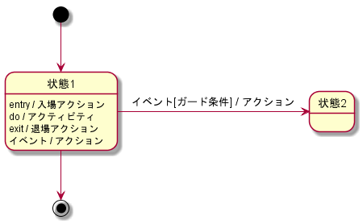
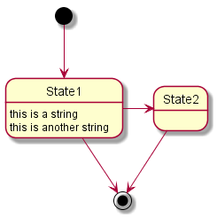
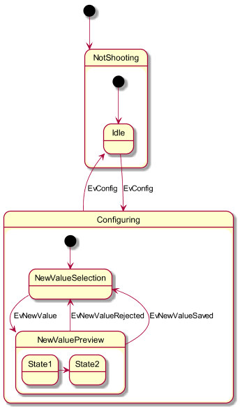
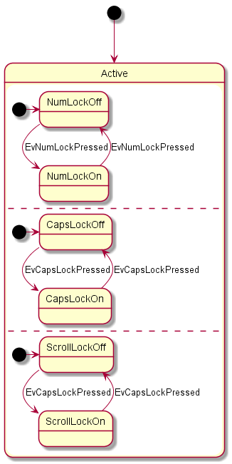
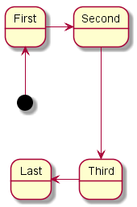
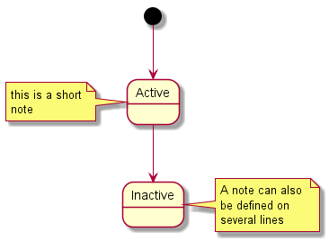
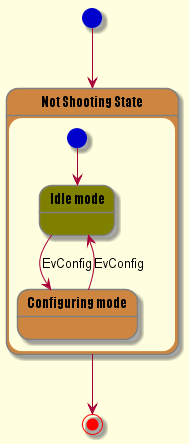

# PlantUMLサンプル集（ステートチャート）



# 基本

```
@startuml state.1_basic

[*] --> State1 
State1 --> [*] 
State1 : this is a string 
State1 : this is another string

State1 -> State2 
State2 --> [*]

@enduml
```

- `[*]`で開始、終了状態
- `state`キーワードで状態定義可
- `[*]`や`state`キーワードがあると、ステートチャートとして描画される
    - `[*]`や`state`キーワードがない場合、シーケンス図やクラス図と区別がつかない


# 複合状態

```
@startuml state.2_composition
scale 350 width 
[*] --> NotShooting

state NotShooting { 
[*] --> Idle 
Idle --> Configuring : EvConfig 
Configuring --> Idle : EvConfig 
}

state Configuring { 
[*] --> NewValueSelection 
NewValueSelection --> NewValuePreview : EvNewValue 
NewValuePreview --> NewValueSelection : EvNewValueRejected 
NewValuePreview --> NewValueSelection : EvNewValueSaved

state NewValuePreview { 
State1 -> State2
}

}
@enduml
```

- `state Foo { xxx }`で、状態の中に状態を描画できる

# 領域

```
@startuml state.3_region
[*] --> Active
state Active { 
[*] -> NumLockOff 
NumLockOff --> NumLockOn : EvNumLockPressed 
NumLockOn --> NumLockOff : EvNumLockPressed
--
[*] -> CapsLockOff 
CapsLockOff --> CapsLockOn : EvCapsLockPressed 
CapsLockOn --> CapsLockOff : EvCapsLockPressed 
--
[*] -> ScrollLockOff 
ScrollLockOff --> ScrollLockOn : EvCapsLockPressed 
ScrollLockOn --> ScrollLockOff : EvCapsLockPressed 
}
@enduml
```

- `---`で、領域を示す区切り線

# 矢印の向き

```
@startuml state.4_arrow
[*] -up-> First 
First -right-> Second 
Second ---> Third 
Third -left-> Last
@enduml
```

- right, left, up, downで矢印の方向を制御できる
- 右方向と下方向は簡易記法あり
    - `->`で右方向
    - `-->`で下方向


# 注釈

```
@startuml state.5_note
[*] --> Active 
Active --> Inactive

note left of Active : this is a short\nnote

note right of Inactive 
A note can also 
be defined on 
several lines 
end note
@enduml
```

# スキン

```
@startuml state.6_skin

skinparam backgroundColor LightYellow 
skinparam state { 
StartColor MediumBlue 
EndColor Red 
BackgroundColor Peru 
BackgroundColor<<Warning>> Olive 
BorderColor Gray 
FontName Impact 
}

[*] --> NotShooting

state "Not Shooting State" as NotShooting {
state "Idle mode" as Idle <<Warning>> 
state "Configuring mode" as Configuring 
[*] --> Idle 
Idle --> Configuring : EvConfig 
Configuring --> Idle : EvConfig 
}

NotShooting --> [*] 
@enduml
```
