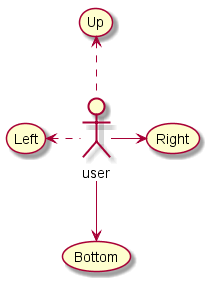
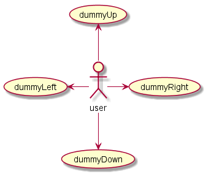

# PlantUMLサンプル集（ユースケース図）


```
@startuml uml_usecase
left to right direction
skinparam packageStyle rectangle 

actor "アクター" as user1
actor "汎化" as user2

user1 <|- user2

rectangle Usecase {
usecase "ユースケース\n--\n拡張ポイント" as uc1

usecase uc2 as "包含ユースケース
--
あるユースケースが
他のユースケースを
利用する"

usecase uc3 as "拡張ユースケース
--
ある条件の時だけ利用する"

uc1 .> uc2 : <<include>> 
uc3 .> uc1 : <<extend>>
}

user2 -- uc1

@enduml
```

# ユースケースの定義

```
@startuml uc.1_usecese
(First usecase) 
(Another usecase) as (UC2) 
usecase UC3 
usecase (Last\nusecase) as UC4
@enduml
```

- `(Foo)`又は`usecase Foo`でユースケースを定義する

# アクターの定義

```
@startuml uc.2_actor
:First Actor: 
:Another\nactor: as Men2 
actor Men3 
actor :Last actor: as Men4
@enduml
```

- `:Foo:`又は`actor Foo`でアクターを定義する

# ユースケース記述

```
@startuml uc.3_description
usecase UC1 as "You can use 
several lines to define your usecase. 
You can also use separators. 
--
Several separators are possible. 
== 
And you can add titles: 
..Conclusion.. 
This allows large description."
@enduml
```

- `\n`で改行可能
- ダブルクォーテーションで囲むことで、複数行にわたって記述可能
    - この場合、`as`による記述順序が他と異なる？

# 簡単な例

```
@startuml uc.4_example
User -> (Start) 
User --> (Use the application) : A small label

:Main Admin: ---> (Use the application) : This is\nyet another\nlabel
@enduml
```

# 継承

```
@startuml uc.5_inheritance
:Main Admin: as Admin 
(Use the application) as (Use)

User <|-- Admin 
(Start) <|-- (Use)
@enduml
```

# ノート

```
@startuml uc.6_note
:Main Admin: as Admin 
(Use the application) as (Use)

User -> (Start) 
User --> (Use)
Admin ---> (Use)
note right of Admin : This is an example.
note right of (Use) 
A note can also 
be on several lines 
end note

note "This note is connected\nto several objects." as N2 
(Start) .. N2 
N2 .. (Use) 
@enduml
```

# ステレオタイプ

```
@startuml uc.7_stereotype
User << Human >> 
:Main Database: as MySql << Application >> 
(Start) << One Shot >> 
(Use the application) as (Use) << Main >>

User -> (Start) 
User --> (Use)
MySql --> (Use)

@enduml
```

# 矢印の向き

```
@startuml uc.8_arrow1
:user: --> (Bottom)
:user: -> (Right)
(Up) <.. :user:
(Left) <. :user:
@enduml
```

- `-->`で縦方向、`->`で横方向


```
@startuml uc.8_arrow2
:user: -left-> (dummyLeft) 
:user: -right-> (dummyRight) 
:user: -up-> (dummyUp) 
:user: -down-> (dummyDown) 
@enduml
```

# 規定の描画方向

```
@startuml uc.9_direction1
'default 
top to bottom direction 
user1 --> (Usecase 1) 
user2 --> (Usecase 2)
@enduml
```

- デフォルトは、`-->`の規定方向はtop-down


```
@startuml uc.9_direction2
left to right direction 
user1 --> (Usecase 1) 
user2 --> (Usecase 2)
@enduml
```

- `left to right direction`で、`-->`の規定方向がleft-rightになる

# スキンパラメータ

```
@startuml uc.10_skin
skinparam handwritten true
skinparam usecase { 
BackgroundColor DarkSeaGreen 
BorderColor DarkSlateGray
BackgroundColor<< Main >> YellowGreen 
BorderColor<< Main >> YellowGreen
ArrowColor Olive 
ActorBorderColor black 
ActorFontName Courier
ActorBackgroundColor<< Human >> Gold 
}

User << Human >> 
:Main Database: as MySql << Application >> 
(Start) << One Shot >> 
(Use the application) as (Use) << Main >>

User -> (Start) 
User --> (Use)
MySql --> (Use)
@enduml
```

# 完全な例

```
@startuml uc.11_example
left to right direction 
skinparam packageStyle rectangle 

actor customer 
actor clerk 

rectangle checkout { 
    customer -- (checkout) 
    (checkout) .> (payment) : include 
    (help) .> (checkout) : extends 
    (checkout) -- clerk 
} 
@enduml
```
