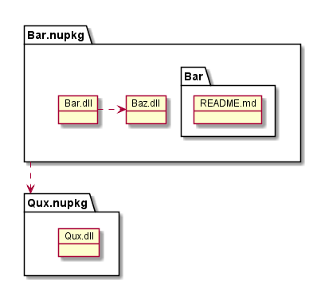

# nugetパッケージの作り方

# 手順

1. マニフェストファイル（nuspecファイル）を作成する
    - VisualStudioプロジェクトからひな形を生成する
        - プロジェクトファイルがある場所で下記コマンドを実行する  
          `> nuget.exe spec`
    - DLLからnusupecファイルのひな形を生成する
        - `> nuget.exe spec xxx.dll`
1. nuspecファイルを編集する
1. nugetパッケージを作成する
    - VisualStudioプロジェクトからnugetパッケージを作成する
        - `> nuget.exe pack -Properties Configuration=Release xxx.csproj`
    - nuspecファイルからnugetパッケージを作成する
        - `> nuget.exe pack xxx.nuspec`

- nugetコマンドラインツールは以下から入手できる
    - https://www.nuget.org/downloads

# マニフェストファイル（nuspecファイル）例

## Fooパッケージ


```xml
<?xml version="1.0"?>
<package >
  <metadata>
    <id>$id$</id>
    <version>$version$</version>
    <title>$title$</title>
    <authors>$author$</authors>
    <owners>$author$</owners>
    <requireLicenseAcceptance>false</requireLicenseAcceptance>
    <description>$description$</description>
    <releaseNotes>Creating nuget package.</releaseNotes>
    <copyright>Copyright 2018</copyright>
  </metadata>
  <files>
    <file src="bin/Release/Foo.dll" target="lib/net461"/>
  </files>
</package>
```

## Barパッケージ



```xml
<?xml version="1.0"?>
<package >
  <metadata>
    <id>Bar</id>
    <version>$version$</version>
    <title>$title$</title>
    <authors>$author$</authors>
    <owners>$author$</owners>
    <requireLicenseAcceptance>false</requireLicenseAcceptance>
    <description>$description$</description>
    <releaseNotes>Creating nuget package.</releaseNotes>
    <copyright>Copyright 2018</copyright>
    <dependencies>
      <!-- 依存パッケージ -->
      <dependency id="Qux" version="1.0.0"/>
    </dependencies>
  </metadata>
  <files>
    <!-- 参照に追加 -->
    <file src="bin/Release/Bar.dll" target="lib/net461"/>
    <file src="bin/Release/Baz.dll" target="lib/net461"/>
    <!-- プロジェクトに追加 -->
    <file src="README.md" target="content/Bar"/>
  </files>
</package>
```

# リンク

- [NuGet パッケージの作成 - Microsoft](https://docs.microsoft.com/ja-jp/nuget/create-packages/creating-a-package)
- [.nuspecリファレンス - Microsoft](https://docs.microsoft.com/ja-jp/nuget/reference/nuspec)
- [プライベートなnugetパッケージを作る - Qiita](https://qiita.com/Temarin/items/f8847bf787c161e874e6)
