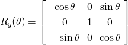
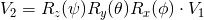
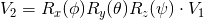
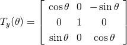
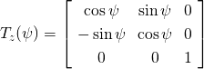
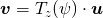

# 座標変換

# 回転行列

<!--
R_x(\phi) = \left[
\begin{array}{ccc}
1 & 0 & 0 \\
0 & \cos\phi & -\sin\phi \\
0 & \sin\phi & \cos\phi \\
\end{array}
\right]
-->

    

<!--
R_y(\theta) = \left[
\begin{array}{ccc}
\cos\theta & 0 & \sin\theta \\
0 & 1 & 0 \\
-\sin\theta & 0 & \cos\theta \\
\end{array}
\right]
-->

    

<!--
R_z(\psi) = \left[
\begin{array}{ccc}
\cos\psi & -\sin\psi & 0 \\
\sin\psi & \cos\psi & 0 \\
0 & 0 & 1 \\
\end{array}
\right]
-->

    

- 例）x軸 → y軸 → z軸の順番に回転する回転行列
<!--
V_2 = R_z(\psi)R_y(\theta)R_x(\phi) \cdot V_1
-->

    

- 例）z軸 → y軸 → x軸の順番に回転する回転行列
<!--
V_2 = R_x(\phi)R_y(\theta)R_z(\psi) \cdot V_1
-->

    

# 座標変換行列

<!--
T_x(\phi) = \left[
\begin{array}{ccc}
1 & 0 & 0 \\
0 & \cos\phi & \sin\phi \\
0 & -\sin\phi & \cos\phi \\
\end{array}
\right]
-->

    

<!--
T_y(\theta) = \left[
\begin{array}{ccc}
\cos\theta & 0 & -\sin\theta \\
0 & 1 & 0 \\
\sin\theta & 0 & \cos\theta \\
\end{array}
\right]
-->

    

<!--
T_z(\psi) = \left[
\begin{array}{ccc}
\cos\psi & \sin\psi & 0 \\
-\sin\psi & \cos\psi & 0 \\
0 & 0 & 1 \\
\end{array}
\right]
-->

    

- 例）U座標系のベクトルuをV座標系（U座標系のZ軸回りに偏差φの座標系）に変換
<!--
\bm{v} = T_z(\psi) \cdot \bm{u}
-->

    

